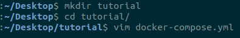
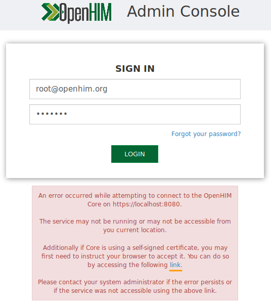
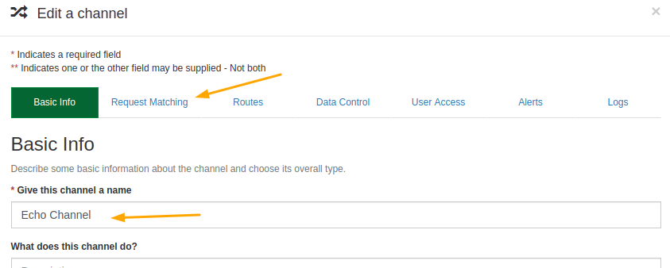
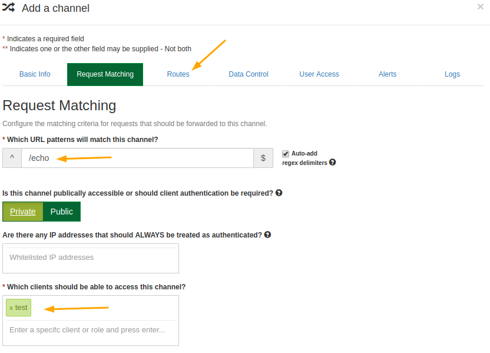
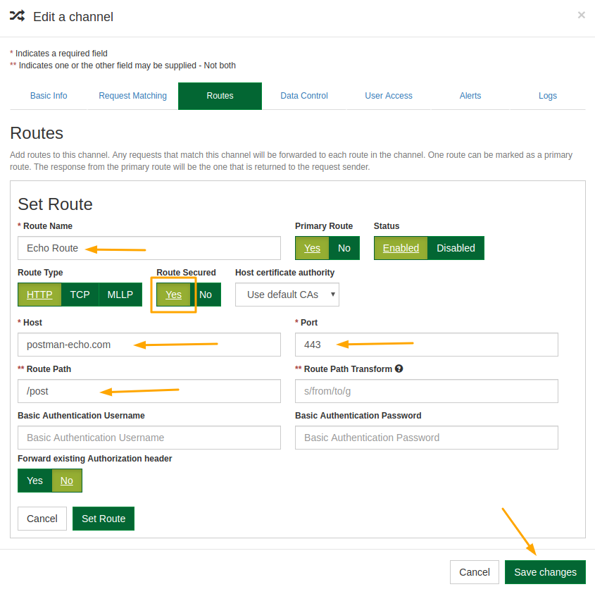

# 

## **OpenHIM SetUp Tutorial**

**TLDR; Watch Linux Tutorial Setup on [YouTube](https://www.youtube.com/watch?v=)**

## Useful Links

[OpenHIM Resources](http://openhim.org/)

[OpenHIM Core Github Repository](https://github.com/jembi/openhim-core-js)

[Jembi Health Systems NPC](https://www.jembi.org/)

## Introduction

> Tutorial Purpose: Get local OpenHIM Core and Console instances running on your computer.

The Open Health Information Mediator(OpenHIM) is a middleware component designed to allow data transfer between diverse information systems by routing, orchestrating and translating requests as they flow between systems.

In this tutorial we will be starting up an OpenHIM instance on your local machine and creating client profile to allow client authentication with the OpenHIM Core.

## Prerequisites

This tutorial assumes that you have [docker](https://docs.docker.com/) and [docker-compose](https://docs.docker.com/compose/) installed on you computer. The tutorial instructions are Linux based.

[docker](https://www.digitalocean.com/community/tutorials/how-to-install-and-use-docker-on-ubuntu-18-04) and [docker-compose](https://www.digitalocean.com/community/tutorials/how-to-install-docker-compose-on-ubuntu-18-04) install instructions

---

## Project Setup

### Step 1 - Creating the `docker-compose` script

Open a terminal and make a directory in which to store a docker-compose script.
Create the file `docker-compose.yml`.



Then copy the setup script below into the file.

```yaml
version: '3'
networks:
  openhim:

services:
  mongo-db:
    container_name: mongo-db
    image: mongo:3.4
    networks:
      - openhim
    volumes:
      - "mongo-data:/data/db"
    restart: unless-stopped

  openhim-core:
    container_name: openhim-core
    image: jembi/openhim-core:5
    restart: unless-stopped
    environment:
      mongo_url: "mongodb://mongo-db/openhim-development"
      mongo_atnaUrl: "mongodb://mongo-db/openhim-development"
      NODE_ENV: "development"
    ports:
      - "8080:8080"
      - "5000:5000"
      - "5001:5001"
    networks:
      - openhim
    healthcheck:
     test: "curl -sSk https://openhim-core:8080/heartbeat || exit 1"
     interval: 30s
     timeout: 30s
     retries: 3

  openhim-console:
    container_name: openhim-console
    image: jembi/openhim-console:1.13
    restart: unless-stopped
    networks:
      - openhim
    ports:
      - "9000:80"
    healthcheck:
     test: "curl -sS http://openhim-console || exit 1"
     interval: 30s
     timeout: 30s
     retries: 3

volumes:
  mongo-data:

```

---

### Step 2 - Starting the OpenHIM

In the terminal, whilst still in the directory containing the `docker-compose.yml` file, run the following command:

```sh
docker-compose up
```

> Include `-d` in the previous command if you want the process to run in the background.

The docker-compose script will start up the OpenHIM-core, OpenHIM-console and a MongoDB instance. All these services communicate with each other over a defined docker network. This network will be important in the next step.

---

### Step 3- Changing OpenHIM default password

On a browser, navigate to `http://localhost:9000`. You will be presented with the OpenHIM Console login page:


Enter the default username and password: `root@openhim.org` : `openhim-password`.

As this is a development environment the SSL certificate is self-signed and cannot be authenticated. Therefore after entering the default credentials a textbox will appear beneath the login button requesting that the user follow a link to allow the browser to accept the self-signed certificate.



Depending on the browser the browser will load a screen indicating that the certificate cannot be validated. To bypass this click the advanced options then click on the link to proceed to the localhost destination.


Finally you will be presented with a screen requiring to reset the default user's password. For this tutorial please set this to `password` for simplicity.

---

### Step 4 - Adding an OpenHIM client

On the OpenHIM Console, navigate to the `Clients` menu option. Under the client's section click the add client button.

In the _Add a client_ modal, fill in the following details, Add New Role **admin** (press `Enter` after typing in **admin**), then **Save changes**:

- **Client ID** : test
- **Client Name** : test
- **Basic Auth Password** & **Confirm Password** : test


> The client ID and password are going to be needed later for authenticating requests to the OpenHIM.

### Step 5 - Testing the OpenHIM Routing

In this step, we are going to create a Channel in the OpenHIM which will route a request from our `test` client through to an echo server which will respond with the data we sent it. The purpose of this is demonstrate the OpenHIM routing as well as the insight gained into our tutorial system that we gain from the Transaction Log.

To start, navigate to the Channels menu option in the OpenHIM Console. Click on **+ Channel** icon to add our first channel. In the modal, add channel name then click on the `Request Matching` tab.



In this tab, our url pattern will be `/echo` and our `test` client will be given access to the Channel. Then navigate to the `Routes` tab.



Click the **Add New Route** button then input the following information:

- Route Name: **Echo Route**
- Host: **postman-echo.com**
- Port: **443**
- Route Path: **/post**

Select `Yes` for Secured Route, then click Save changes.



To send our request, open a new terminal and enter the following curl command:

```sh
curl -X POST http://localhost:5001/echo -H "Authorization: Basic $(echo -n test:test | base64)" -H "content-type: application/text" --data "Hello Echo Server!!!"
```

Look for the data field in the response body in the terminal output.

```sh
{"args":{},"data":"Hello Echo Server!",
```

To view this request within the OpenHIM, navigate to the **Transactions Log** in the Console and click on the transaction row to view details.

On this details page you can see the status of the transaction, which client made the request and to which Channel, and the last key feature is the orchestrations section. This section is very useful when your request goes through a chain OpenHIM mediators. The orchestrations section then gives a summary of all the requests that went through as part of your transaction. This list is useful in diagnosing where in your request chain an issue may be occurring. In this case there was only one request therefore the status of the transaction is that of the request. When there are multiple requests occurring as part of transaction then the status reflects the overall outcome of the requests.


---
