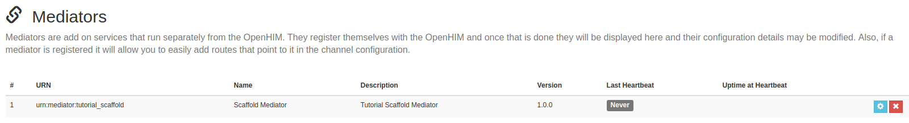
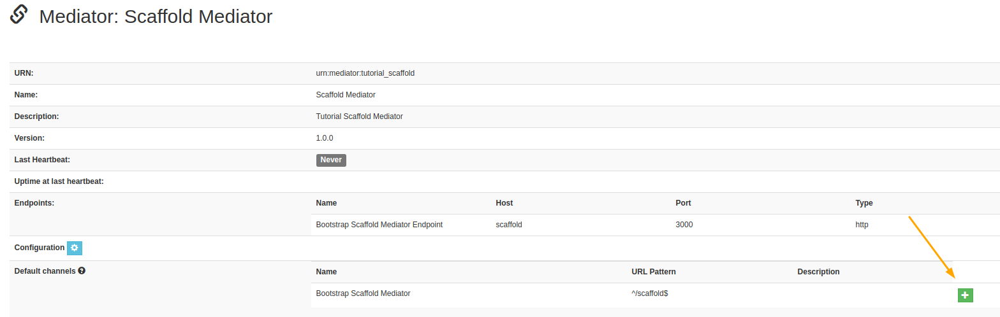
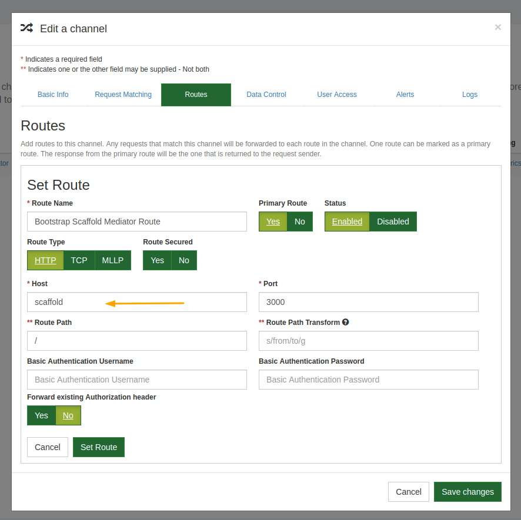
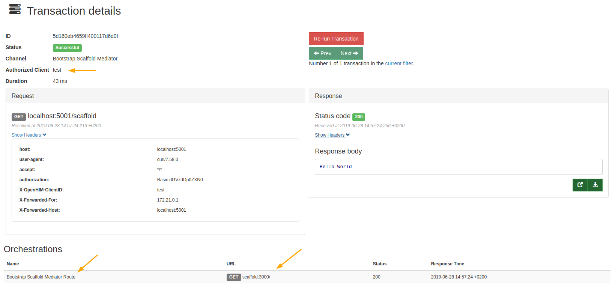

# 

## **Scaffold OpenHIM Mediator Tutorial**

**TLDR; Watch Tutorial Setup on [YouTube](https://www.youtube.com/watch?v={vid-ID})**

## Useful Links

[OpenHIM Resources](http://openhim.org/)

[OpenHIM Scaffold Bootstrap Mediator](https://github.com/jembi/openhim-mediator-bootstrap-scaffold)

[Jembi Health Systems NPC](https://www.jembi.org/)

## Introduction

> Tutorial Purpose: Create a Scaffold OpenHIM Mediator and Register it with your local OpenHIM instance.

This mediator is purely for demonstration purposes and is in no way production ready. However, the mechanisms used in this mediator can easily be used in your own OpenHIM mediator projects. The repository is also useful to read through as there are detailed comments describing important aspects of an OpenHIM Mediator.

The advantage of using the OpenHIM mediator framework over another stand alone service is that OpenHIM mediators are registered and tracked by your OpenHIM instance. This allows administrators to **view the health status** of the mediator, to easily setup **routing** and **logging** to the registered mediator and to **provide new configuration** settings to the mediator all from the OpenHIM Console.

## Prerequisites

- NodeJS and NPM

This tutorial assumes you have already successfully setup the OpenHIM.

Having a basic understanding of ExpressJS and Javascript ES6 syntax is advised.

---

## OpenHIM Mediator Setup

### Step 1 - Creating project skeleton

In a terminal, create a directory for your project. Move into that directory and and run `npm init` and fill in the details you want:

```sh
mkdir openhim-mediator-bootstrap-scaffold
cd openhim-mediator-bootstrap-scaffold
npm init
```

Within the same terminal install the following packages to compile the ES6 code that will be in our project.

```sh
npm install babel-env babel-cli
```

> Do not use babel-node in your production mediator. It uses a lot of memory and has a high start up cost as it compiles your project on the fly.

Open up your preferred Integrated Development Environment(IDE) and create an `index.js` file. Next, edit the `package.json` file that was created by the npm init step and replace the `scripts` field with the following:

```json
"scripts": {
  "start": "babel-node index.js"
},
```

Next, create a file titled `Dockerfile`. Within it place the following YAML script:

```yaml
FROM node:10-alpine
WORKDIR /app

COPY . /app

RUN npm install

CMD npm start
EXPOSE 3000
```

In your IDE move back to the `index.js` file. Here enter teh following script to setup a basic express server listening on port 3000.

```js
'use strict'

import express from 'express'

const app = express()

app.all('*', (req, res) => {
  res.send('Hello World')
})

app.listen(3000, () => {
  console.log('Server listening on port 3000...')
})
```

Then, open a terminal in the project directory and run the following commands:

```sh
docker build -t scaffold .

docker run --rm -p 3000:3000 scaffold
```

You should see the terminal output **Server listening on port 3000...**

Test that the mediator is responding correctly by navigating to `localhost:3000` on a browser where you should see **Hello World**

---

### Step 2 - Registering the Mediator with the OpenHIM

In a terminal install the npm OpenHIM Mediator Utils package. This utils package enable quick mediator setup as it handles OpenHIM authentication, registering mediator, fetching mediator configuration from the OpenHIM, and creating the mediator heartbeat emitter.

```sh
npm install openhim-mediator-utils
```

In your IDE, create a new file called `mediatorConfig.json`. Within this file place the following JSON configurations:

```json
{
  "urn": "urn:mediator:tutorial_scaffold",
  "version": "1.0.0",
  "name": "Scaffold Mediator",
  "description": "Tutorial Scaffold Mediator",
  "defaultChannelConfig": [
    {
      "name": "Bootstrap Scaffold Mediator",
      "urlPattern": "^/scaffold$",
      "routes": [
        {
          "name": "Bootstrap Scaffold Mediator Route",
          "host": "scaffold",
          "path": "/",
          "port": "3000",
          "primary": true,
          "type": "http"
        }
      ],
      "allow": ["admin"],
      "methods": ["GET", "POST"],
      "type": "http"
    }
  ],
  "endpoints": [
    {
      "name": "Bootstrap Scaffold Mediator Endpoint",
      "host": "scaffold",
      "path": "/",
      "port": "3000",
      "primary": true,
      "type": "http"
    }
  ]
}
```

Open `index.js` and import the registerMediator function from `openhim-mediator-utils` as well as the `mediatorConfig.json` file. Next declare a new object openhimConfig with the details below and instantiate the `registerMediator` function with `openhimConfig`, `mediatorConfig`, and a callback

```js
import { registerMediator } from 'openhim-mediator-utils'
import mediatorConfig from './mediatorConfig.json'

// Express Server Code

const openhimConfig = {
  username: 'root@openhim.org',
  password: 'password',
  apiURL: 'https://openhim-core:8080',
  trustSelfSigned: true
}

registerMediator(openhimConfig, mediator, err => {
  if (err) {
    console.error('Failed to register mediator. Check your Config:', err)
    process.exit(1)
  }
})
```

Rebuild the scaffold docker image to include the new changes. Then look up the name of the docker bridge network over which your running openhim instance should be communicating. And finally, start the container including the _network_ flag.

> The docker network name is made of the directory name where the docker-compose script was run appended with **openhim**. In this case `tutorial_openhim`

```sh
docker build -t scaffold .

docker network ls

docker run --network tutorial_openhim --name scaffold --rm -p 3000:3000 scaffold
```

> **Important!** Remember to use the `--name` flag. The name is required to allow the different containers to reference each other.

Check that your mediator has registered correctly by navigating to the OpenHIM Console Mediator Page on `https://localhost:9000/#!/mediators`



---

### Step 3 - Adding Default Channel

Next we can setup the default channel. On the Mediators page in the Console, click on the mediator row. This page contains more details about the scaffold mediator. The bottom row describes the available default channel. Click the green plus icon on the right hand bottom corner to create this channel.



Once the channel is created navigate to the Channels Menu option to view the Channel. To view the channel details you can click on yellow edit icon on the channel. All the details here are already correct as they were set in the `mediatorConfig.json` file. Navigate to the Routes tab in the modal and click on the yellow edit route icon to view route details.



The Route defines where a client's request will be directed. Since we are running the scaffold mediator in a `docker container` we have provided the docker container name as the route `host` variable. `Docker` will resolve requests to the correct IP.

---

### Step 4 - Sending Through First Request Via OpenHIM

With our scaffold mediator channel route setup we can send through our first request that will be tracked by the OpenHIM.
In a terminal run the following `cURL` command:

```sh
curl -X GET http://localhost:5001/scaffold -H "Authorization: Basic $(echo -n test:test | base64)"
```

**Hello World** should come through in the terminal response. To view the request and response details navigate to the OpenHIM Console [Transactions Log](http://localhost:9000/#!/transactions) page. Here you should see your first scaffold mediator transaction.


Click on this transaction to view details about it.



The transaction here was Successful, it went through the Bootstrap Scaffold Mediator Channel, and the client was our `test` client. If needed this transaction could be rerun by clicking the Re-run Transaction button. This would send through the exact same request details and keep a record of the original transaction and any child transactions with all their respective results.

The transaction response and `orchestrations` in the transaction can be updated through the OpenHIM API at a later time if necessary. This is useful for asynchronous requests.

> For example, in a hypothetical system our endpoint information system has a slow processing speed yet, during peak times, our system sends through more requests than the end system can handle. To solve this we could input a [file-queue mediator](https://github.com/jembi/openhim-mediator-file-queue) between the OpenHIM and an orchestration mediator that would store all requests from the client and slowly feed them through to the endpoint via the orchestrator when the endpoint is ready. At the same time, the OpenHIM could respond to the client indicating that the `file-queue mediator` received the request. Each time the client's request gets a response from a mediator this would be added to the list of orchestrations along the request and response details. When the final response is received the transaction can be updated to reflect the overall status of that transaction. ie: Successful, Failed, Completed, or Completed with Errors.

---

### Step 4 - Adding Mediator Heartbeat

To add a mediator heartbeat, import the `activateHeartbeat` method form `openhim-mediator-utils`. This function takes in the `openhimConfig` option set to instantiate as well as the mediator's `urn` within that object. Therefore, to keep the file neat let's import the `urn` from `mediatorConfig` and add this variable to the openhimConfig object. Instantiate the `activateHeartbeat` method within the `app.listen`. The `index.js` file should now resemble this:

> Why is the `activateHeartbeat` function always instantiated within the `app.listen` function

```js
'use strict'

import express from 'express'
import { registerMediator, activateHeartbeat } from 'openhim-mediator-utils'
import mediatorConfig, { urn } from './mediatorConfig.json'

const app = express()

const openhimConfig = {
  username: 'root@openhim.org',
  password: 'password',
  apiURL: 'https://openhim-core:8080',
  trustSelfSigned: true,
  urn
}

app.all('*', (req, res) => {
  res.send('Hello World')
})

app.listen(3000, () => {
  console.log('Server listening on port 3000...')
  activateHeartbeat(openhimConfig)
})

registerMediator(openhimConfig, mediatorConfig, err => {
  if (err) {
    console.error('Check your config!', err)
    process.exit(1)
  }
})
```

---

### Step 5 - Fetching Mediator Configuration from openHIM

To enable the OpenHIM to store console editable configuration details, we need to provide the template for these details within the `mediatorConfig.json` file. Add the following config template information beneath the **endpoints** entry within the `mediatorConfig.json`.

```json
,"configDefs": [
  {
    "param": "tutorial",
    "displayName": "Tutorial variables",
    "description": "Some variables to demonstrate fetching OpenHIM mediator config",
    "type": "struct",
    "array": false,
    "template": [
      {
        "param": "variable_1",
        "displayName": "Variable 1",
        "description": "First Variable",
        "type": "string"
      },
      {
        "param": "variable_2",
        "displayName": "Variable 2",
        "description": "Second Variable",
        "type": "string"
      }
    ]
  }
]
```

Next, within `index.js` import `fetchConfig` from `openhim-mediator-utils` and instantiate `fetchConfig` with the `openhimConfig` object.

```js
import { fetchConfig } from 'openhim-mediator-utils`'

fetchConfig(openhimConfig, (err, initialConfig) => {
  if (err) {
    console.error(err)
    process.exit(1)
  }
  console.log('Initial Config: ', JSON.stringify(initialConfig))
})
```

Test the fetch config function is working on the console. To do this, navigate to the [mediators page](https://localhost:9000/#!/mediators) on the OpenHIM Console then delete the existing scaffold mediator there.


Back in your terminal rebuild the scaffold mediator docker image and start the container.

```sh
docker build -t scaffold .

docker run --network tutorial_openhim --rm --name scaffold -p 3000:3000 scaffold
```

The terminal output should be:


Go back to the mediator page and click the blue gear icon. In the Modal enter something into the fields.


Go back to your terminal and stop the container. Restart it and your should see your config input.


This function is useful however, the OpenHIM is capable of updating specific configuration details on the fly and emit a notification to the mediator to get the new config. This function is tied to the activateHeartbeat function.
Make the following changes to the `index.js` file:

```js
const emitter = activateHeartbeat(openhimConfig)

emitter.on('error', err => {
  console.error('Heartbeat failed: ', err)
})

emitter.on('config', newConfig => {
  console.log('Received updated config:', JSON.stringify(newConfig))
})
```

Rebuild and start the new container. Your old config entries should be in the terminal output as the _initial config_.

```sh
docker build -t scaffold .

docker run --network tutorial_openhim --rm --name scaffold -p 3000:3000 scaffold
```

Go to the mediators page and click the blue gear icon to edit the mediator config. Enter some new data in the fields and save changes. This will emit a `config` event which will now be picked up by the mediator.


Switch back to your terminal and the new config should be in the terminal output.


---
