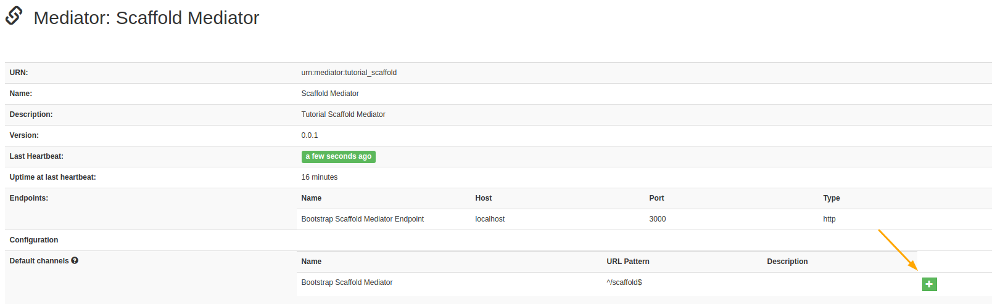

# Mediator Tutorial Setup

**TLDR; Watch Tutorial Setup on [YouTube](https://www.youtube.com/watch?v=DUr_mBWIVXk)**

## Introduction

> Tutorial purpose: To help get a custom OpenHIM mediator up and running with your business logic in place.

The Open Health Information Mediator(OpenHIM) is a middleware component designed to allow data transfer between diverse information systems by routing, orchestrating and translating requests as they flow between systems. Custom orchestration and translation is accomplished by extending the OpenHIM through the mediator framework ie: OpenHIM Mediators. Mediators are useful for providing implementation specific processing. For example, a client wants a list of data in JSON. The source of this data is from an old system that requires a weird authentication procedure and only provides data in xml. Instead of making changes to either the client system of the data source system the OpenHIM along with an OpenHIM mediator would act as the translator between these two systems. By abstracting away the data transformation and authentication mechanisms this leaves the client and data systems free to only deal with their primary concerns.


In this tutorial we will be designing an orchestrator mediator that will accept a request from the client for a list of Health Facilities. In our example, the client wants the facility list in JSON format. [DHIS2](https://docs.dhis2.org/2.28/en/user/html/ch02s02.html) is the source of our facility data and in this example only provides the data in XML. Therefore, our mediator will have to translate the data from XML into JSON before sending the response back to the client.

The advantage of using the OpenHIM mediator framework over another stand alone service is that OpenHIM mediators are registered and tracked by your OpenHIM instance. This allows administrators to **view the health status** of the mediator, to easily setup **routing** and **logging** to the registered mediator and to **provide new configuration** settings to the mediator all from the OpenHIM Console.

---

## Prerequisites

This tutorial was performed on an Ubuntu 18.04 system and requires the following to already be installed:

* [git](https://www.digitalocean.com/community/tutorials/how-to-install-git-on-ubuntu-18-04-quickstart)
* [Docker](https://www.digitalocean.com/community/tutorials/how-to-install-and-use-docker-on-ubuntu-18-04)
* [docker-compose](https://www.digitalocean.com/community/tutorials/how-to-install-docker-compose-on-ubuntu-18-04)

The `git` repositories needed are as follows:

* [Bootstrap Scaffold Mediator](https://github.com/jembi/openhim-mediator-bootstrap-scaffold)
* [Bootstrap Orchestrator Mediator](https://github.com/jembi/openhim-mediator-bootstrap-orchestrator)
* [OpenHIM Core v5.2.0](https://github.com/jembi/openhim-core-js)

> Knowledge about ExpressJS and cURL would be helpful though not essential.

---

## Mediator Setup

### Step 1 - Starting up an OpenHIM container

From the OpenHIM Core repository move into the `infrastructure` directory and start the containers.

```sh
cd infrastructure/

sudo docker-compose up
```

> Include `-d` in the previous command if you want the process to run in the background.

The docker-compose script will start up the OpenHIM-core, OpenHIM-console and a MongoDB instance. All these services communicate with each other over a defined docker network. This network will be important in the next step.

### Step 2 - Changing OpenHIM default password

On a browser, navigate to `http://localhost:9000`. You will be presented with the OpenHIM Console login page:


Enter the default username and password: `root@openhim.org` : `openhim-password`.

As this is a development environment the SSL certificate is self-signed and cannot be authenticated. Therefore after entering the default credentials a textbox will appear beneath the login button requesting that the user follow a link to allow the browser to accept the self-signed certificate.


Depending on the browser the browser will load a screen indicating that the certificate cannot be validated. To bypass this click the advanced options then click on the link to proceed to the localhost destination.


Finally you will be presented with a screen requiring to reset the default user's password. For this tutorial please set this to `password` for simplicity.

### Step 3 - Adding an OpenHIM client

On the OpenHIM Console, navigate to the `Clients` menu option. Under the client's section click the add client button.

In the *Add a client* modal, assign the client the existing **admin** role, fill in the following details, and **Save changes**:

* **Client ID** : test
* **Client Name** : test
* **Basic Auth Password** & **Confirm Password** : test


> The client ID and password are going to be needed later for authenticating requests to the OpenHIM.

### Step 3 - Starting up the Scaffold mediator

From the scaffold mediator root directory build the scaffold docker container:

```sh
docker build -t scaffold .
```

Before starting the scaffold mediator container you will need the network name on which the OpenHIM core and console are running. This can be found by running:

```sh
docker network ls
```

The output should include `infrastructure_openhim`. Use the network name to start up the container:

```sh
docker run --network infrastructure_openhim -p 3000:3000 --name scaffold -e OPENHIM_TRUST_SELF_SIGNED=true scaffold
```

Environmental variables can be set using the `-e` flag.

Naming(`--name`) the container is optional but this will prove useful later when referencing this particular instance.

Exposing the port(`-p`) to localhost is optional but will be useful to test the mediator without going through the OpenHIM.

### Step 4 - Configuring Scaffold mediator channel and route

The bootstrap mediator is purely an express app listening on `localhost:3000` that will respond with *Hello World* when it receives any request on any url path.
To check this you can navigate to `localhost:3000` on any browser.

For the OpenHIM use case you will need to open up the OpenHIM console in a browser. From here navigate to the mediator menu option. Here you should see your scaffold mediator registered. Click on row.


This page contains more details about the scaffold mediator. The bottom row describes the available default channel. Click the green plus icon on the right hand bottom corner to create this channel.



Navigate to the Channels menu option to view the channel. Click the yellow edit icon on the right hand side to view the channel details. Here you'll need to enable the types of HTTP methods allowed through this channel. For now just enable `GET` and `POST`. After enabling some HTTP methods navigate to the `Routes` tab.


The Route defines where a client's request will be directed. In this case you can see that the current host destination is set to `localhost`. This host setting was configured for running the mediator directly on the host machine using npm. Since we are running the mediator in a `docker container` we need the docker container's IP. However, by providing the container name `docker` will direct requests to the correct IP. Therefore, replace `localhost` with `scaffold` then **Save Changes**.


Finally, we can send a request through the OpenHIM to the mediator and get a response back to the client.

From the terminal run the following curl command:

```sh
curl -X GET http://localhost:5001/scaffold -H "Authorization: Basic $(echo -n test:test | base64)"
```

The response in the terminal should be **Hello World**.
In the OpenHIM Console navigate to the `Transactions` menu option. Here you should see your first scaffold mediator transaction.


Click on this transaction to view details about it.
In the image below there are a few useful aspects to note:


The transaction here was Successful, it went through the Bootstrap Scaffold Mediator Channel, and the client was our `test` client. If needed this transaction could be rerun by clicking the Re-run Transaction button. This would send through the exact same request details and keep a record of the original transaction and any child transactions with all their respective results.

The transaction response and `orchestrations` in the transaction can be updated through the OpenHIM API at a later time if necessary. This is useful for asynchronous requests.

> For example, in a hypothetical system our endpoint information system has a slow processing speed yet, during peak times our system sends through more requests than the end system can handle. To solve this we could input a [file-queue mediator](https://github.com/jembi/openhim-mediator-file-queue) between the OpenHIM and an orchestration mediator that would store all requests from the client and slowly feed them through to the endpoint when the endpoint is ready. At the same time the OpenHIM could respond to the client indicating that the `file-queue mediator` received the request. Each time the client's request gets a response from a mediator this would be added to the list of orchestrations along the request and response details. When the final response is received the transaction can be updated to reflect the overall status of that transaction. ie: Successful, Failed, Completed, or Completed with Errors.

---
