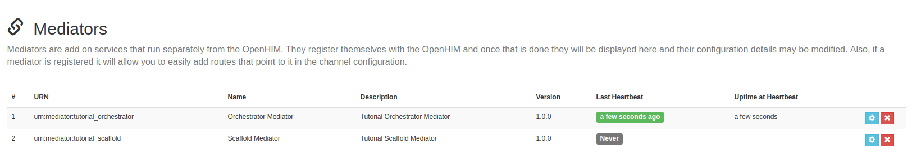
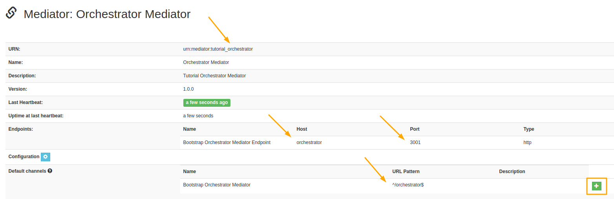
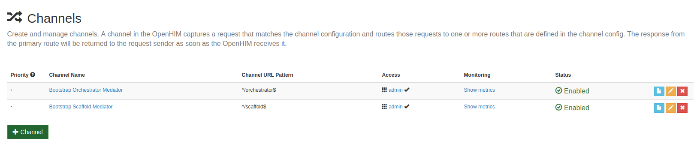
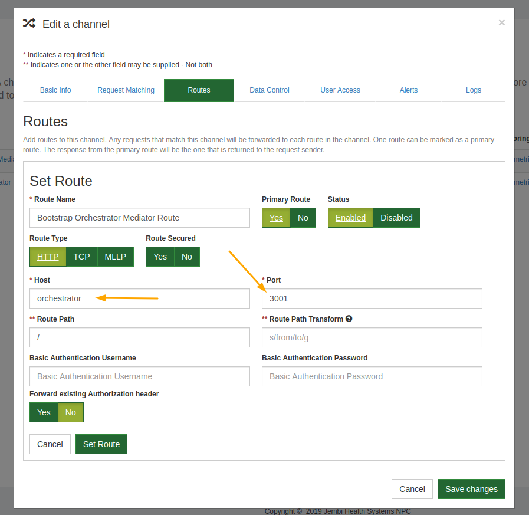

# 

## **OpenHIM Mediator With Custom Logic Tutorial**

**TLDR; Watch Linux Tutorial Setup on [YouTube](https://www.youtube.com/watch?v=)**

## Useful Links

[OpenHIM Resources](http://openhim.org/)

[OpenHIM Orchestrator Bootstrap Mediator](https://github.com/jembi/openhim-mediator-bootstrap-orchestrator)

[Jembi Health Systems NPC](https://www.jembi.org/)

## Introduction

> Tutorial Purpose: Create an Orchestrator OpenHIM Mediator registered with your local OpenHIM instance that illustrates how to implement your own custom mediator logic.

In this tutorial we will be designing an orchestrator mediator that will accept a request from the client for a list of Health Facilities. In our example, the client wants the facility list in JSON format. [DHIS2](https://docs.dhis2.org/2.28/en/user/html/ch02s02.html) is the source of our facility data and in this example only provides the data in XML. Therefore, our mediator will have to translate the data from XML into JSON before sending the response back to the client.


## Prerequisites

- NodeJS and NPM

This tutorial assumes you've setup the OpenHIM and understand the basics of an openHIM Mediator.

Having a solid understanding of ExpressJS and Javascript ES6 syntax is advised.

---

## OpenHIM Mediator Setup

### Step 1 - Preparing the Scaffold Mediator to be used for the Orchestrator

We will use the [OpenHIM Bootstrap Scaffold Mediator](https://github.com/jembi/openhim-mediator-bootstrap-scaffold) from the [previous tutorial](https://github.com/jembi/openhim-mediator-tutorial/blob/master/1_Scaffold_OpenHIM_Mediator.md) as the starting point for the orchestrator.

To keep the two mediators from conflicting, the first thing we need to change for the orchestrator is the port numbers. Let's configure the `Orchestrator` to expose port 3001 _instead_ of 3000 so that the two mediators can run at the same time. The files that set the port numbers are: `index.js`, `Dockerfile`, and `mediatorConfig.json`.

```js
//index.js
app.listen(3001, () => {
  console.log('Server listening on port 3001...')
```

```yaml
#Dockerfile
EXPOSE 3001
```

The last change is in the mediatorConfig.json and package.json files. Where ever the word scaffold was used replace this with **orchestrator**. Your `mediatorConfig` file should now resemble this:

```json
{
  "urn": "urn:mediator:tutorial_orchestrator",
  "version": "1.0.0",
  "name": "Orchestrator Mediator",
  "description": "Tutorial Orchestrator Mediator",
  "defaultChannelConfig": [
    {
      "name": "Bootstrap Orchestrator Mediator",
      "urlPattern": "^/orchestrator$",
      "routes": [
        {
          "name": "Bootstrap Orchestrator Mediator Route",
          "host": "orchestrator",
          "path": "/",
          "port": "3001",
          "primary": true,
          "type": "http"
        }
      ],
      "allow": ["admin"],
      "methods": ["GET", "POST"],
      "type": "http"
    }
  ],
  "endpoints": [
    {
      "name": "Bootstrap Orchestrator Mediator Endpoint",
      "host": "orchestrator",
      "path": "/",
      "port": "3001",
      "primary": true,
      "type": "http"
    }
  ],
  "configDefs": [
    {
      "param": "tutorial",
      "displayName": "Tutorial variables",
      "description": "Some variables to demonstrate fetching OpenHIM mediator config",
      "type": "struct",
      "array": false,
      "template": [
        {
          "param": "variable_1",
          "displayName": "Variable 1",
          "description": "First Variable",
          "type": "string"
        },
        {
          "param": "variable_2",
          "displayName": "Variable 2",
          "description": "Second Variable",
          "type": "string"
        }
      ]
    }
  ]
}
```

Test the new project by building the image, get the docker network name, and start the container:

```sh
docker build -t orchestrator .

docker network ls

docker run --network {openhim-network} -p 3001:3001 --name orchestrator --rm orchestrator
```

Open up the OpenHIM Console Mediators page in a browser and you should see your new mediator listed.



Important mediator changes are indicated in the following image. Once your orchestrator mediator is properly configured click the green **Add channel** button in the bottom right corner.



On the [OpenHIM Console Channels](http://localhost:9000/#!/channels) page you should see your new orchestrator channel.



Click the yellow edit channel icon to view details of the channel. Go to the **Route** tab and check that the host value is `orchestrator` and the port is **3001**.



---
